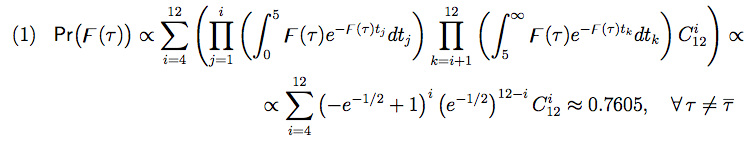
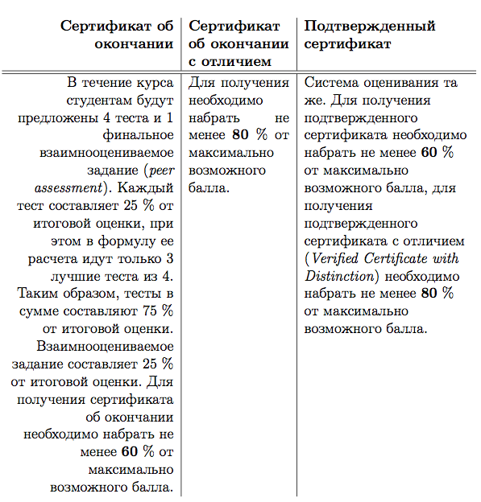
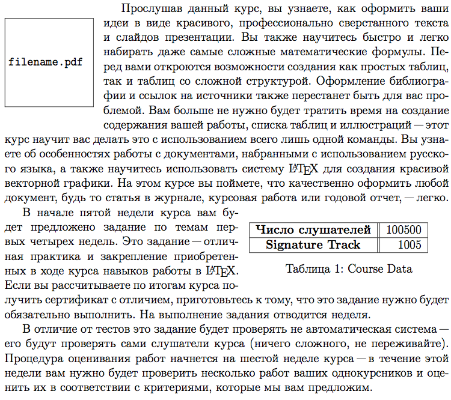
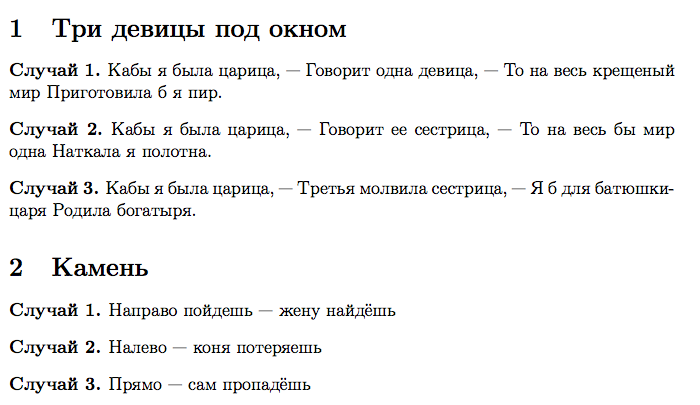

### Финальный экзамен курса [Документы и презентации в LaTeX (Introduction to LaTeX)](https://class.coursera.org/latex-001) на Coursera.

#### Задания

1. Какую команду нужно написать в преамбуле документа, чтобы нумерация формул в нем состояла из римских цифр, а не из арабских, как обычно?

2. В качестве ответа на вопрос приложите один .tex-файл, при компиляции которого будет создан PDF-документ, содержащий только следующий фрагмент.

3. Для выполнения вопроса вам понадобится [этот необработанный текст](materials/peer3.txt).
В качестве ответа на вопрос приложите один .tex-файл, при компиляции которого будет создан PDF-документ, содержащий только следующую таблицу. Ширина таблицы должна соответствовать ширине текста на странице (используйте такие же размеры полей, как использовались в шаблонах на нашем курсе). 

4. Используя [вот эту картинку](materials/filename.pdf), создайте .tex-файл, в котором будет 5 ее вариантов, пронумерованных с помощью списка *enumerate*:
  1. Картинка с ее исходным размером.
  2. Картинка, имеющая размер в 2 раза меньше.
  3. Картинка, имеющая высоту 4 см и такие же пропорции, что и исходная картинка.
  4. Картинка, имеющая ширину 2 см и высоту 4 см.
  5. Картинка, имеющая ширину в 10% от ширины текста.
Упакуйте .tex-файл вместе с файлом картинки в архив ZIP и загрузите.

5. В качестве ответа на вопрос приложите один .tex-файл, при компиляции которого будет создан PDF-документ, содержащий только следующий фрагмент. Используйте такие же размеры полей, как использовались в шаблонах на нашем курсе. 
Скачать необработанный вариант этого текста можно [здесь](materials/peer1.txt).

6. Для выполнения вопроса вам понадобится [этот образец](materials/peer1.pdf).
Измените класс документа на *book*. Введите обычным способом вымышленное имя автора документа и любой заголовок, создайте титульный лист командой *\maketitle*. Создайте ненумерованный раздел «Предисловие» (предисловие должно начинаться с новой страницы после титульного листа и идти до того, как начинаются главы) и воспроизведите тот фрагмент, который приведен в образце (текст и его оформление должны в точности повторять то, что вы видите в образце; ссылка должна быть активной; список должен быть создан с помощью окружения *itemize*). Сделайте в документе раздельную пагинацию: до конца предисловия страницы должны нумероваться римскими цифрами (при этом на титульном листе номер страницы не должен быть проставлен), после предисловия — арабскими. Создайте после предисловия главу (chapter) с любым содержанием не менее чем на 2 страницы. Получившийся .tex-файл загрузите.

7. Создайте новое окружение типа theorem для оформления случаев и назовите его *case*. Сделайте так, чтобы счетчик case автоматически обнулялся с началом нового раздела. Создайте документ из двух разделов, как показано на рисунке. В этом документе все «случаи» должны быть созданы с помощью окружения *case*, которое вы сами определили. Необработанный [исходный текст здесь](materials/peer2.txt). В качестве ответа приложите .tex-файл.

8. Создайте презентацию из одного фрейма (frame), максимально близко воспроизводящую [вот этот файл](materials/peer2.pdf). Картинка должна быть нарисована в TikZ. В качестве ответа приложите .tex-файл.